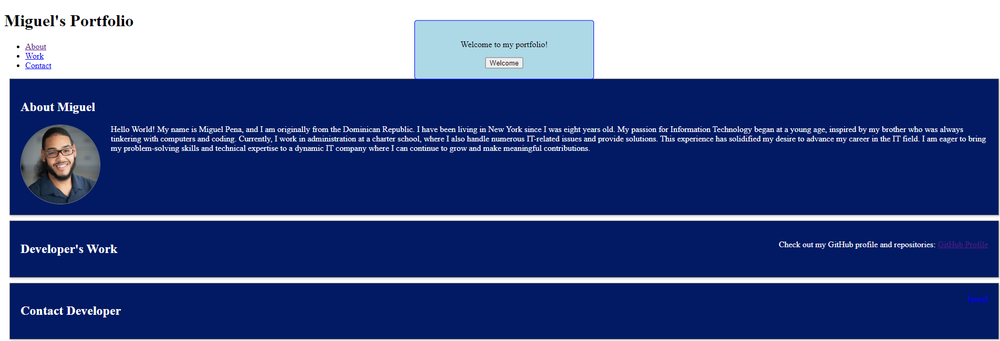

# Personal Portfolio Page

 <!-- Make sure to replace this with the actual path to your screenshot -->

## About

This is a personal portfolio webpage created to showcase my projects and skills in web development using HTML, CSS, and JavaScript. It includes information about me, my projects, and how to contact me.

## Features

- **About Me:** A section that gives an overview of my background and skills.
- **Projects:** A showcase of various projects I have worked on with links to their repositories.
- **Contact:** Information on how to reach me for potential job opportunities or collaborations.

## Installation

To run this project locally, follow these steps:

1. Clone the repository:
    ```bash
    git clone https://github.com/MiguelPena0101/Personal-Page.git
    ```
2. Navigate to the project directory:
    ```bash
    cd Personal-Page
    ```
3. Open `index.html` in your browser to view the webpage.

## Usage

- **Viewing Projects:** Navigate to the Projects section to see a list of projects with descriptions and links.
- **Contacting Me:** Use the contact form or the provided contact information to get in touch.


## Reources 

**HTML and CSS:**

- [MDN Web Docs - HTML Basics](https://developer.mozilla.org/en-US/docs/Learn/Getting_started_with_the_web/HTML_basics)
- [MDN Web Docs - CSS Basics](https://developer.mozilla.org/en-US/docs/Learn/Getting_started_with_the_web/CSS_basics)
- [W3Schools - HTML Tutorial](https://www.w3schools.com/html/)
- [W3Schools - CSS Tutorial](https://www.w3schools.com/css/)

**JavaScript:**

- [MDN Web Docs - JavaScript Basics](https://developer.mozilla.org/en-US/docs/Web/JavaScript/Guide)
- [W3Schools - JavaScript Tutorial](https://www.w3schools.com/js/)
- [JavaScript.info - The Modern JavaScript Tutorial](https://javascript.info/)

**General Web Development:**

- [freeCodeCamp - Responsive Web Design Certification](https://www.freecodecamp.org/learn/)
- [Codecademy - Learn HTML & CSS](https://www.codecademy.com/learn/learn-html-css)
- [Coursera - HTML, CSS, and Javascript for Web Developers](https://www.coursera.org/learn/html-css-javascript-for-web-developers)

## Contact

You can reach me through the following channels:

- **GitHub:** [MiguelPena0101](https://github.com/MiguelPena0101)

